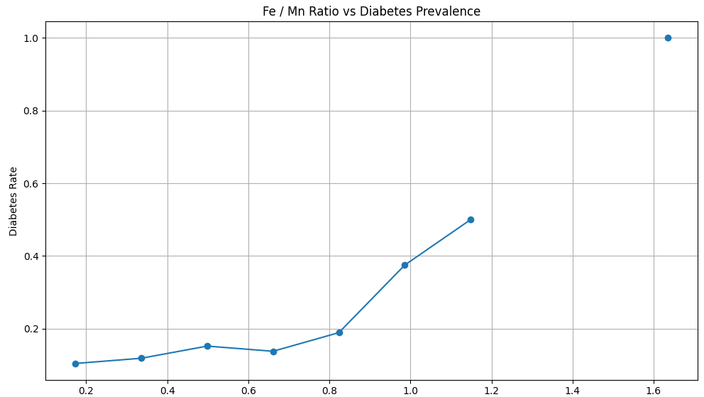

# fe-mn-diabetes

Open-source scientific analysis of the iron-to-manganese (Fe/Mn) ratio and its correlation with diabetes risk using NHANES data.

## Introduction

This project analyzes the relationship between iron (Fe) and manganese (Mn) mineral ratio and diabetes prevalence based on the U.S. National Health and Nutrition Examination Survey (NHANES) dataset. It provides reproducible code to process raw data, calculate Fe/Mn ratios, and visualize diabetes risk trends.

## Features

- Data loading and merging from NHANES raw files  
- Calculation of Fe/Mn ratios and grouping into bins  
- Identification of diabetes status using HbA1c threshold (≥6.5%)  
- Visualization of Fe/Mn ratio versus diabetes prevalence  
- Scientific and reproducible approach for mineral ratio epidemiology  

## Installation

```bash
git clone https://github.com/mineral-pentagon/fe-mn-diabetes.git
cd fe-mn-diabetes
pip install -r requirements.txt
python FeMn_diabetes_analysis.py

## Sample Result Plot

The following plot illustrates the relationship between the iron-to-manganese (Fe/Mn) ratio and diabetes prevalence based on data from the U.S. NHANES survey.



The plot clearly shows an increasing trend in diabetes prevalence as the Fe/Mn ratio rises, supporting the scientific hypothesis that mineral ratios are correlated with diabetes risk.
